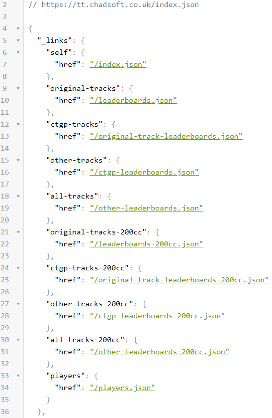
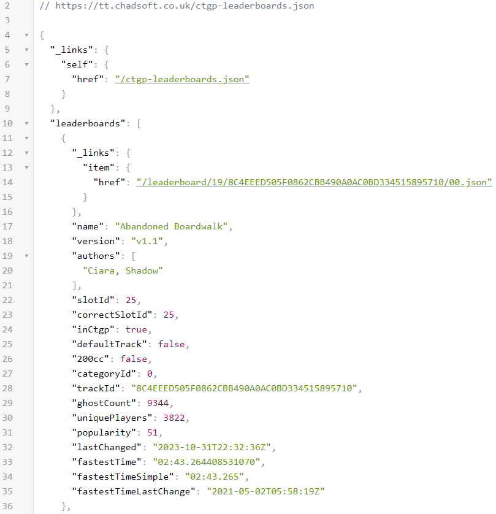
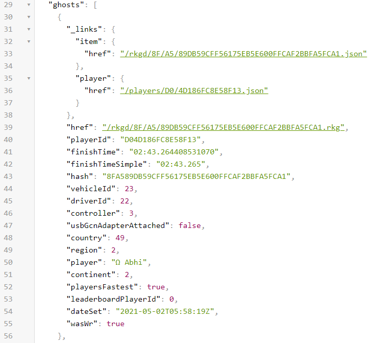

# CTGP Timesheet Downloader and Time Trial Record Leaderboard

The goal of this project was to automate a lot of work which was previously done manually. The problem with the CTGP website is that all tracks are seperated and there are no stats whatsoever. Many people including myself like looking at all tracks records in one location. There used to be a spreadsheet which was updated regularly which housed all the records and some stats in one location, but interest in updating the spreadsheet became very low. Thats why I created the website to automatically display up-to-date time trial records. Another problem with the CTGP website is that there is no names associated with time-trials, instead there is only a playerID. Also, some players may have more than 1 playerID for some reasons. So to give credit to the record holders, a database of playerIDs, player names, and their countries needed to be created.

# Features

Now there are leaderboards for all the Custom Tracks and Custom Gamemodes. Some stats that are calculated are Top 10 longest standing records, Pie charts which have all the used characters and vehicles, as well as lists showing how many records each person has at a given time or how many records a nation has.

Not only records are shown on the website. In the tops page, anyone canuse their playerId to search for any top 10 times they have or search for all of their personal bests on every track. This data can then be downloaded as a CSV file and imported into any spreadsheet software or used for more in depth statistical analysis with stats languages like R.

# CTGP API Documentation

The ctgp API which is used throughout the website has no official documentation so I decided to share what I've learned over time while creating this project. The API is hosted at https://tt.chadsoft.co.uk. The main page is located at [index.json](https://tt.chadsoft.co.uk/index.json). 

There is not much here except there are links to the main leaderboards we want. The main custom track leaderboard is [ctgp-leaderboards.json](https://tt.chadsoft.co.uk/ctgp-leaderboards.json)

This contains a link to itself as well as an array called leaderboards. This array is sorted alphabetically by track name and contains some basic information about the tracks like the record time and record UTC time stamp but is missing important details about records themselves. The information is within the leaderboards."track number you want"._links.item.href location. The time trial ghosts can only be found there.

Below is a sample of a ghost reference. This is contained in a json file which can be navigated to from the previous json. Ex. https://tt.chadsoft.co.uk/leaderboard/19/8C4EEED505F0862CBB490A0AC0BD334515895710/00.json

Here there is an array called ghosts which has every time trial ever finished on the track. It is sorted by fastest times first so the first entry will always be the track record.

Here the important information like characterId, vehicleId, playerId, etc. can be found. PlayerId is used to match a real person to this record. The other Ids are only numbers and need to be converted to what they represent. In the code a switch case statement is used but I have also created a google doc [here](https://docs.google.com/spreadsheets/d/18iAJnUXEt7IZqJNB9cQhVR9s2IrUHRG7TXeKhDH7qM0/edit?usp=sharing).

I haven't found many parameters that work to speed up the fetch process by reducing data fetched but using ?limit=1 can be used on track leaderboards to only get the first ghost, aka the record.